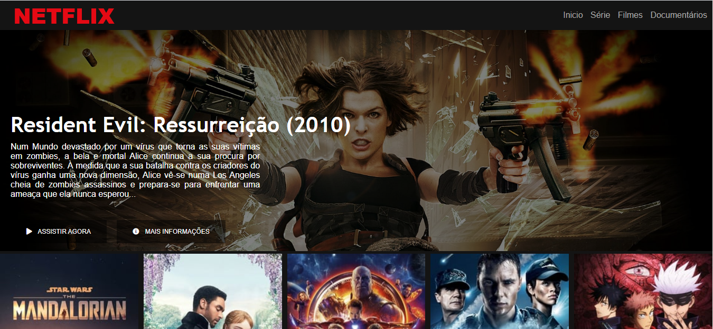

# Criar-Interface-Netflix-Digital-Innovation
Criar interface web da netflix

##### PARTE INICIAL

foi recriado a interface do principal site de netflix utilizando tecnologias simples como HTML5, CSS3 e JavaScript. 

##### DESAFIO DESTE PROJETO
- estruturar um layout
- uso de técnicas de CSS3 com containers e variáveis
- posicionar os elementos com Flexbox 
- utilização plugins Jquery
- uso de media queries para site responsivo

###### SCREENSHOTS	

